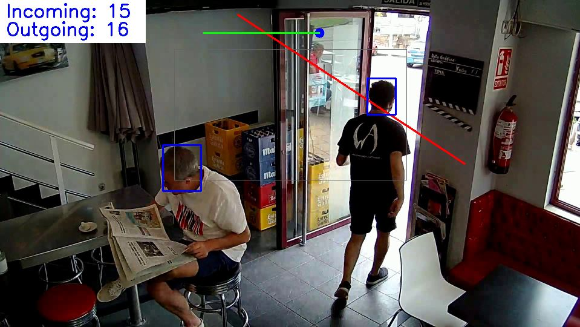

## Packages

        pip install opencv-python
        pip install tensorflow==1.15.*
        pip install kivy
        pip install mysql-connector-python

## Description

Train the model using head dataset and detect the heads. Based on this, count the incoming and outgoing in the retail.
Support 2 models, ssd_mobile_net_v1 and faster_rcnn_resnet50 (this isn't committed to repository)

## Running method

- running script

        python3 main.py
        
    or double click the rub.bat
    
- running engine with UI

        python3 start_ui.py
        
    or double click the run_ui.bat
